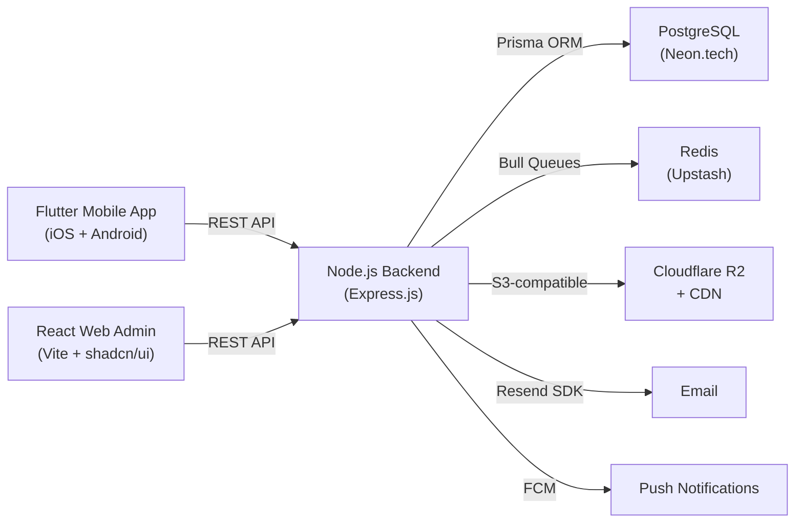

# KodetoCareer Platform — Complete Project Analysis

> **Source:** 10 documents (+ 4 v2 free-stack amendments) in `Documentstofollow/`
> All documents have been read line-by-line. This is a synthesised understanding.

---

## 1. What Is KodetoCareer?

**KodetoCareer** is a **unified Training & Placement Management Platform** for India's tier-2/tier-3 engineering colleges. It combines:

| Layer | What It Does |
|-------|-------------|
| **LMS** | Structured course delivery (videos, PDFs, quizzes, assignments) |
| **ERP** | Operations management (batches, attendance, schedules) |
| **CRM** | Student, college, and recruiter relationship management |
| **Placement Engine** | Tracks every student from enrollment → employment |

**Vision:** Become the operating system for career-focused technical education in India.

**Core Insight:** The training partner (KodetoCareer) sits between colleges and students. No existing platform serves this actor. This is "Salesforce for training companies."

---

## 2. Who Uses It? (4 User Roles)

| Role | Platform | What They Do |
|------|----------|-------------|
| **Super Admin** (KodetoCareer Team) | Web (React) | Manage everything — colleges, batches, trainers, courses, certificates, placements, analytics |
| **College Admin** | Web (React) | Read-only view of their college's students, attendance, progress, placements. Download reports |
| **Trainer** | Web (React) | Create sessions, mark attendance, create quizzes/assignments, grade submissions |
| **Student** | Mobile (Flutter) | Learn courses, take quizzes, submit assignments, view certificates, browse job board |

---

## 3. The Three Codebases



---

## 4. Technology Stack (Free Stack — v2)

> [!IMPORTANT]
> The v2 documents replace **all paid AWS services** with permanently free alternatives. The free stack supports 0–10,000 students at **₹0/month** infrastructure cost.

### Backend
| Component | Technology | Notes |
|-----------|-----------|-------|
| Runtime | Node.js 20 LTS | TypeScript strict mode |
| Framework | Express.js 4.x | Modular monolith |
| ORM | Prisma 5.x | Works with Neon.tech |
| Validation | Zod 3.x | Runtime schema validation |
| Auth | jsonwebtoken (RS256) | Access + refresh token rotation |
| File Upload | Multer + AWS SDK v3 | R2 is S3-compatible |
| Email | Resend SDK | Free 3,000/month |
| Queue | Bull (Upstash Redis) | Background jobs |
| Logging | Winston | Structured logging |
| Process Mgr | PM2 | Cluster mode, 3 instances |

### Frontend Web (Admin Panel)
| Component | Technology |
|-----------|-----------|
| Framework | React 18 + TypeScript |
| Build | Vite 5.x |
| Styling | Tailwind CSS 3.x |
| Components | shadcn/ui |
| State | Zustand 4.x |
| Data Fetching | TanStack React Query 5.x |
| HTTP | Axios 1.x |
| Forms | React Hook Form + Zod |
| Charts | Recharts 2.x |
| Rich Text | TipTap 2.x |
| Video Player | Video.js 8.x |
| Tables | TanStack Table 8.x |

### Mobile (Flutter)
| Component | Technology |
|-----------|-----------|
| Framework | Flutter 3.x |
| State | Riverpod 2.x |
| HTTP | Dio 5.x |
| Storage | flutter_secure_storage |
| Push | firebase_messaging (FCM) |
| Video | video_player + chewie |
| PDF | flutter_pdfview |
| Offline | sqflite |
| Analytics | Firebase Analytics |
| Crash | Firebase Crashlytics |
| Routing | go_router |
| Animations | Lottie |

### Infrastructure (All Free)
| Service | Provider | Free Limit |
|---------|----------|-----------|
| Compute | Oracle Cloud Always Free (ARM) | 4 OCPUs, 24GB RAM, 200GB disk — permanent |
| Database | Neon.tech (Serverless PostgreSQL 15) | 0.5GB, auto point-in-time recovery (7 days) |
| Cache | Upstash Redis | 10,000 cmd/day, 256MB |
| Storage | Cloudflare R2 | 10GB, zero egress |
| CDN + SSL + DNS | Cloudflare Free | Unlimited |
| Email | Resend | 3,000 emails/month |
| Push | Firebase FCM | Free |
| Error Tracking | Sentry | 5,000 errors/month |
| Uptime | UptimeRobot | 50 monitors |
| CI/CD | GitHub Actions | 2,000 min/month |

---

## 5. The 9 Modules to Build

### Module 1: Authentication & Onboarding
- Email/password login for all roles
- Student self-registration with unique code (`KTC-YYYY-XXXXX`)
- OTP email verification (6-digit, via Resend)
- Mandatory 2-step profile setup on first login
- JWT RS256 access tokens (15 min) + refresh token rotation (30 days)
- Rate limiting: 5 failed logins → 15 min block
- Super Admin creates College Admin & Trainer accounts (auto-generated temp password)
- Force password change on first admin login

### Module 2: Course & Content Management
- **Hierarchy:** Course → Module → Lesson
- Lesson types: Video (upload or YouTube/Vimeo URL), PDF notes, rich text, external links
- Drag-and-drop ordering of modules and lessons
- Sequential locking (must complete module N before N+1)
- Course publishing workflow: Draft → Review → Published
- Video delivery: Direct MP4 on Cloudflare R2 CDN **OR** YouTube/Vimeo embed (no transcoding in MVP)
- Student personal notes per lesson
- Video watch progress persistence (resume playback)

### Module 3: Batch & Attendance Management
- Batch = College + Course + Trainer(s) + Students + Schedule
- Bulk student import via CSV (with validation, error reporting per row)
- Class sessions with attendance marking (Present / Absent / Late)
- Trainer can mark attendance up to 24h after session
- Super Admin can override any time (audit logged)
- Auto-calculate attendance % per student per batch
- Flag students below 75% threshold
- Export attendance reports (Excel/PDF)

### Module 4: Assessments (Quizzes & Assignments)
- **Quizzes:** MCQ Single, MCQ Multiple, True/False, Short Text
- Question bank per course/topic with difficulty tags
- Timed quizzes with auto-save every 30 seconds
- Timer warnings at 5 min (yellow) and 1 min (red + vibration)
- Immediate score display with correct answers (configurable)
- Leaderboard per quiz (top 10 by score, then speed)
- Per-question analytics for admins
- **Assignments:** File upload submissions, trainer grading with feedback, late submission tracking

### Module 5: Progress Tracking & Analytics
- **Student dashboard:** Course completion %, attendance rate, quiz average, assignment rate, streak (GitHub-style heatmap), placement readiness score (composite 0–100)
- **Admin dashboard:** Total students/colleges/batches, placements this month, avg attendance, revenue summary
- **"Students at Risk" report:** Attendance <75%, quiz avg <40%, or 14 days inactive
- College-level drill-downs
- All reports exportable to PDF/Excel

### Module 6: Certificates & Documents
- Auto-check eligibility: min attendance %, min quiz avg, all mandatory assignments
- PDF certificate generation (A4 Landscape) with PDFKit: student name, course, date, QR code, certificate ID
- Public verification URL: `verify.kodetocareer.com/{certificate-code}` (no auth required)
- Bulk generation via Bull queue with Socket.io progress tracking
- LinkedIn/WhatsApp share integration
- Offer letter and internship letter storage per student

### Module 7: Placement Management
- Placement status tracking: Not Started → Preparing → Actively Applying → Placed → On Hold
- Placement records: company, role, CTC, offer date, joining date
- Placement analytics dashboard: total placed, avg package, company breakdown, monthly trends
- Placement readiness score algorithm (weighted composite of 7 factors)
- **Job Board:** Admin posts opportunities; students browse, filter by skills, mark "I'm Interested"
- Auto-expire jobs after deadline

### Module 8: Communication System
- Admin/Trainer announcements scoped to: all / college / batch / individual
- In-app notification center + push notifications (FCM)
- Automated email triggers: new lesson, quiz deadline (24h), assignment graded, certificate ready, low attendance
- Weekly automated college report (Sunday 8 PM) to college admins
- SMS removed from MVP (email only); WhatsApp integration in v2

### Module 9: College Dashboard (Partner Portal)
- College Admin sees only their college's data
- KPIs: enrolled students, active batches, attendance rate, quiz scores, placements
- Read-only student profiles
- Downloadable reports (attendance, progress, placement as PDF/Excel)
- Cannot modify any student data
- Weekly automated email summary

---

## 6. Database Design (25+ Tables)

The PostgreSQL schema uses:
- **UUID** primary keys everywhere
- **snake_case** naming convention
- **created_at / updated_at** timestamps on all tables
- **Soft deletes** via `deleted_at` on key tables
- **Multi-tenancy** via `college_id` scoping at application layer
- **Row-Level Security** for college admin role

### Core Tables

| Category | Tables |
|----------|--------|
| **Users & Auth** | `users`, `email_verifications`, `refresh_tokens` |
| **Organization** | `colleges`, `college_admins`, `trainers`, `students` |
| **Course Content** | `courses`, `modules`, `lessons`, `lesson_videos`, `lesson_notes` |
| **Batches** | `batches`, `batch_trainers`, `batch_students` |
| **Attendance** | `class_sessions`, `attendance_records`, materialized `attendance_summary` |
| **Assessments** | `quizzes`, `quiz_questions`, `question_options`, `quiz_attempts`, `quiz_answers`, `assignments`, `assignment_submissions` |
| **Progress** | `student_progress`, `student_notes`, `student_activity_log` |
| **Certificates** | `certificates`, `student_documents` |
| **Placement** | `placement_records`, `job_opportunities`, `job_interests` |
| **Communication** | `notifications`, `notification_recipients` |
| **System** | `audit_logs`, `system_settings` |

---

## 7. API Design

- **Base URL:** `https://api.kodetocareer.com/v1`
- **Style:** RESTful with consistent naming
- **Auth:** Bearer token in `Authorization` header
- **Response envelope:**
  ```json
  { "success": true, "data": {}, "meta": { "page", "limit", "total", "hasNext" } }
  ```
- **Pagination:** Offset-based for admin tables
- **Validation:** Zod schemas on all inputs
- **70+ endpoints** across 11 resource groups (auth, students, colleges, courses, modules/lessons, batches, attendance, assessments, certificates, placements, notifications)

---

## 8. UI/UX Design System

### Color Palette
| Color | Hex | Usage |
|-------|-----|-------|
| Primary Blue | `#1E3A8A` | CTAs, links, active states |
| Light Blue | `#3B82F6` | Hover states |
| Accent Green | `#10B981` | Success, completed |
| Warning Amber | `#F59E0B` | Alerts, pending |
| Danger Red | `#EF4444` | Errors, failed |
| Background | `#F8FAFC` | App background |
| Surface | `#FFFFFF` | Cards, modals |
| Text Primary | `#0F172A` | Headlines |
| Text Secondary | `#475569` | Labels, descriptions |

### Typography
- **Font:** Inter (Google Fonts) — all weights
- **Code font:** JetBrains Mono
- **8px base grid** spacing system

### Key Design Patterns
- Skeleton loaders over spinners
- Progress visible at all times
- Celebration animations (Lottie) for completions
- India-first: design for variable connectivity, show file sizes before streaming
- 44×44px minimum touch targets on mobile
- Lucide Icons (outline style)
- Web sidebar: dark background (`#0F172A`), 240px expanded / 64px collapsed

---

## 9. App Flows (Key Screens)

### Student Mobile App (Flutter) — 5-Tab Bottom Nav
1. **Home** (`STUDENT_DASHBOARD`) — Continue Learning card, Today's Snapshot, Upcoming, Announcements
2. **Learn** (`COURSE_LIST`) — Courses with progress bars → Course Detail → Lesson Player
3. **Tests** (`QUIZ_LIST`) — Quizzes with timer/auto-save → Results → Leaderboard
4. **Placement** (`PLACEMENT_HUB`) — Status, readiness score, job board, certificates, documents
5. **Profile** (`MY_PROFILE`) — Edit info, skills, settings, logout

### Admin Web Panel (React) — Sidebar Nav
- Dashboard, Colleges, Students, Trainers, Courses, Batches, Assessments, Certificates, Placements, Communication, Analytics, Settings

### College Admin Portal (React) — Scoped Views
- Dashboard, Student List (read-only), Attendance Reports, Progress Reports, Placement Reports

---

## 10. Implementation Plan (10-Week Sprints)

| Sprint | Week | Focus | Deliverable |
|--------|------|-------|-------------|
| 1 | Week 1 | **Foundation & Auth** | Registration, login, JWT, profile setup |
| 2 | Week 2 | **College & User Mgmt** | College CRUD, trainer/student management, CSV import |
| 3 | Week 3 | **Course & Content** | Course builder, modules, lessons, PDFs |
| 4 | Week 4 | **Video Delivery** | Direct MP4 on R2 + YouTube embed, video player |
| 5 | Week 5 | **Batch & Attendance** | Batch wizard, attendance marking, reports |
| 6 | Week 6 | **Assessments** | Quiz engine (all question types), assignments, grading |
| 7 | Week 7 | **Certificates** | PDF generation pipeline, public verification, documents |
| 8 | Week 8 | **Placement Hub** | Placement tracking, job board, readiness score |
| 9 | Week 9 | **Communication & Portal** | Notifications, push, college admin portal, analytics |
| 10 | Week 10 | **Polish & Launch** | Testing, performance, error states, app store submission |

---

## 11. Business Context

| Metric | Target |
|--------|--------|
| MVP Timeline | 10 weeks |
| Pilot Colleges | 3 |
| Active Students (3 months) | 500+ |
| DAU Target | 40%+ of enrolled |
| Revenue per student | ₹15,000–₹40,000 |
| Year 3 Scale | 200 colleges, 50,000 students |
| SaaS licensing to other trainers | ₹50,000–₹2,00,000/year per partner |

---

## 12. Project Structure (Backend)

```
kodetocareer-api/
├── src/
│   ├── config/          (database, redis, r2, email, app)
│   ├── middleware/       (auth, rbac, rateLimiter, errorHandler, auditLog, validate)
│   ├── modules/         (auth, users, colleges, students, trainers, courses,
│   │                     modules-lessons, batches, attendance, quizzes,
│   │                     assignments, certificates, placements, jobs,
│   │                     notifications, analytics)
│   ├── jobs/            (Bull workers: video, certificate, email, report)
│   ├── services/        (storage, email, fcm, pdf, analytics)
│   ├── utils/           (response, pagination, codeGenerator, csvParser, logger)
│   └── index.ts
├── prisma/              (schema, migrations, seed)
├── tests/               (unit, integration)
├── .env.example
├── docker-compose.yml
└── Dockerfile
```

---

> [!NOTE]
> I have now fully studied and understood all 10 documents. I'm ready to begin building. What would you like to start with?
